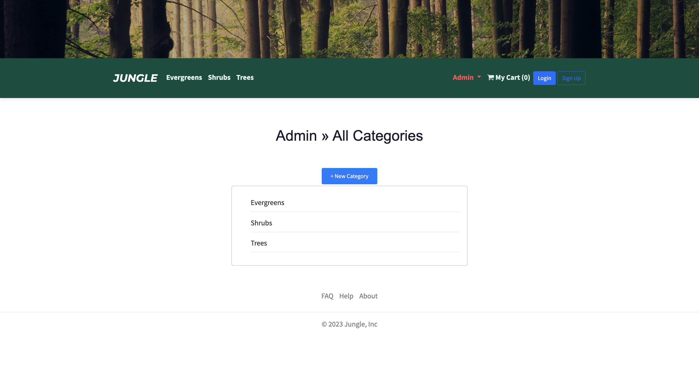
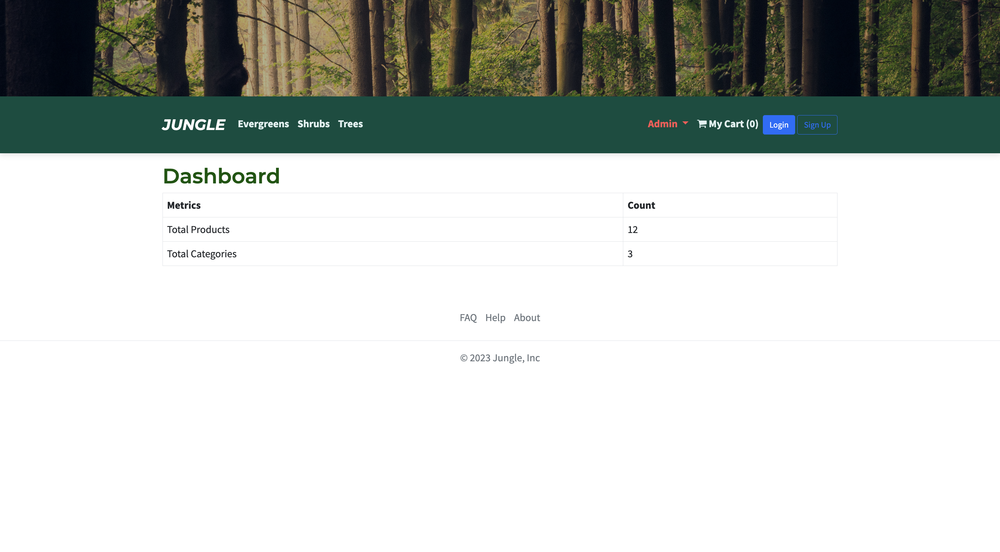
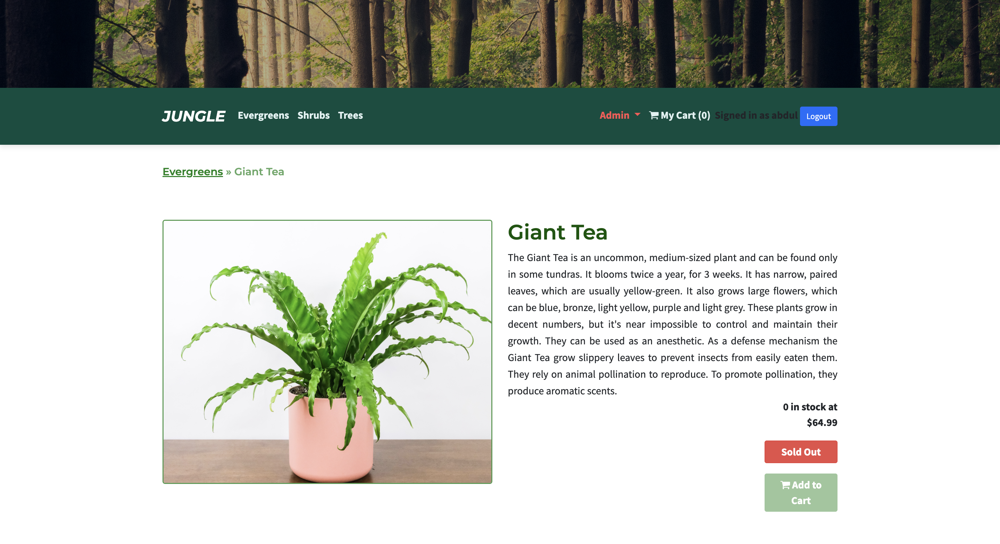
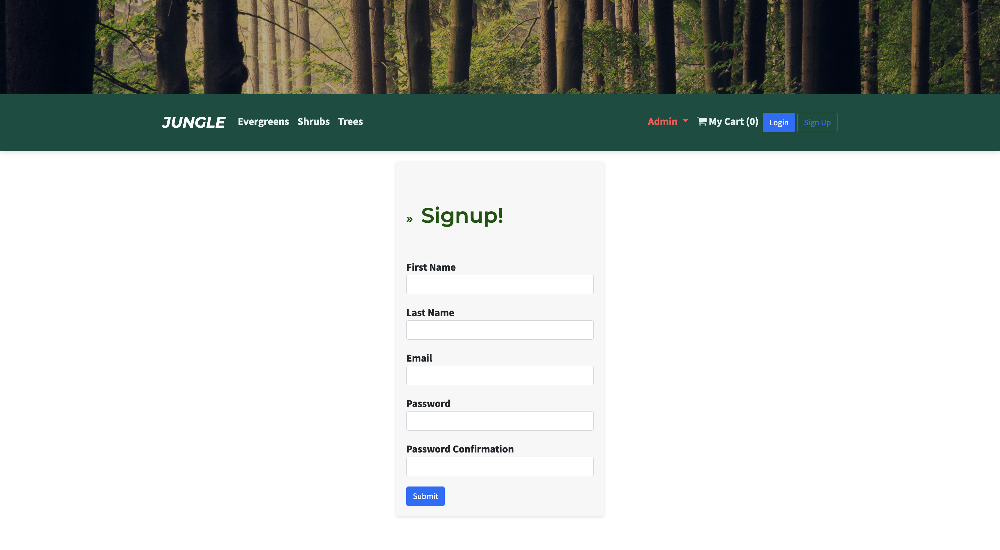
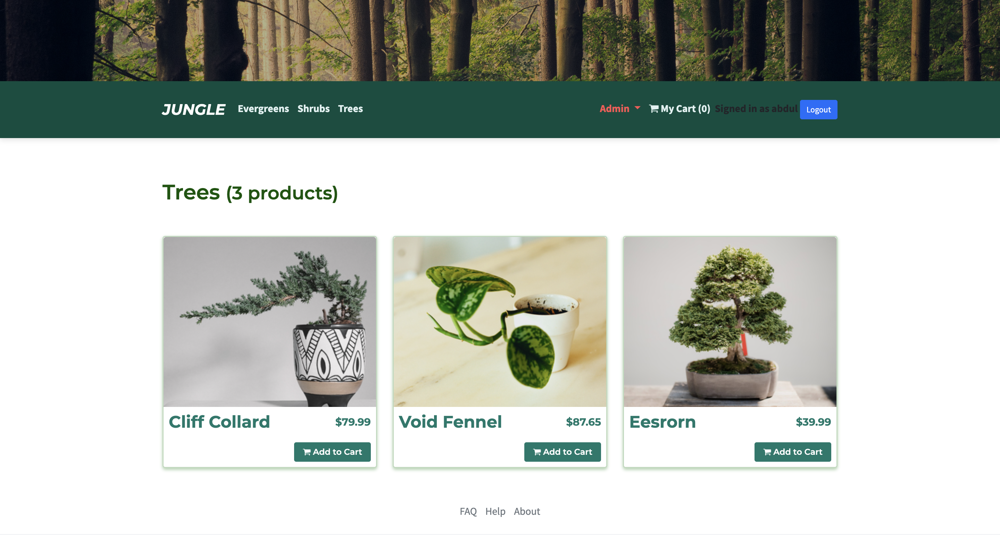

# Jungle 

A mini e-commerce application built with Rails 6.1 for purposes of learning a new language and inheriting a new code base. Implementing bug fixes and features as I learn the language and code base. Inherit the code on June 28th 2023.

## Setup

1. Run `bundle install` to install dependencies
2. Create `config/database.yml` by copying `config/database.example.yml`
3. Create `config/secrets.yml` by copying `config/secrets.example.yml`
4. Run `bin/rails db:reset` to create, load and seed db
5. Create .env file based on .env.example
6. Sign up for a Stripe account
7. Put Stripe (test) keys into appropriate .env vars
8. Run `bin/rails s -b 0.0.0.0` to start the server

## Database

If Rails is complaining about authentication to the database, uncomment the user and password fields from `config/database.yml` in the development and test sections, and replace if necessary the user and password `development` to an existing database user.

## Stripe Testing

Use Credit Card # 4111 1111 1111 1111 for testing success scenarios.

More information in their docs: [Stripe Testing Documentation](https://stripe.com/docs/testing#cards)

## Dependencies

- Rails 6.1 [Rails Guide](http://guides.rubyonrails.org/v6.1/)
- Bootstrap 5
- PostgreSQL 9.x
- Stripe

## Bug Fixes:

- Fix admin auth (committed on Jun 29, 2023)
- Fix empty cart UI (committed on Jun 28, 2023)
- Fix admin page price (committed on Jun 28, 2023)
- Merge branch 'fix/money-formatting' (committed on Jun 28, 2023)
- Fix cart UI price (committed on Jun 28, 2023)

## Features Added:

- Implement feature/user-auth (committed on Jul 3, 2023)
- Implement more stylization changes to product display (committed on Jul 2, 2023)
- Add stylizations to top nav bar (committed on Jul 2, 2023)
- Implement feature/admin-categories (committed on Jul 2, 2023)
- Implement about page (committed on Jul 1, 2023)
- Add testing for home page (committed on the current day)
- Implement Cypress testing into project folder (committed on the current day)
- Test user model specs (committed on the current day)
- Implement model spec for product (committed on the current day)
- Setup RSpec for use in Rails (committed on the current day)
- Feature/dashboard-counts (committed on Jun 29, 2023)
- Try feature on branch (committed on Jun 29, 2023)
- UI Change: order details, now shows email and other information after... (committed on Jun 29, 2023)
- Implement sold-out badge when item has 0 quantity (committed on Jun 29, 2023)

## Implementation

### Implemented Categories page to add or edit Categories

### Display Total of Products on Client Side

### Implemented Login

### Implemented Sold Out Feature that does not allow for adding to cart if product is not in stock

### Implemented Sign up with Auth

### Display Product Category

